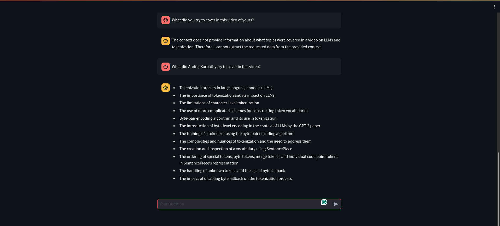

# LLM Challenge



This repository is an implementation of a [Fun Twitter challenge](https://twitter.com/karpathy/status/1760740503614836917?t=mxQWqIdW5T51PXeeEvMvpw) posted by Andrej Karpathy.

## Requirements

```
llama-index llama-index-llms-gemini chromadb torch transformers rich streamlit
```

## Approach

1. First the [video](https://www.youtube.com/watch?v=zduSFxRajkE&pp=ygUPYW5kcmVqIGthcnBhdGh5) was downloaded from Youtube.
2. In the next stage, since the video is >2hrs, 5 secs segments of this video was created by running the script: `src/segment_video.py` using the following command:

```bash
python segment_video.py --video_path ../data/andrej_karpathy_video.mp4
```

3. After creating the segments of this video file, the audio from each of these segments were extracted by running the script: `src/extract_audio.py` using the following command:

```bash
python extract_audio.py --segments ../data/segments
```

4. After obtaining the audio for each of the segments, the transcriptions for each of these audio were obtained by running the script: `src/transcribe_segments.py` using the following command:

```bash
python transcribe_segments.py --segments ../data/audio_segments
```

5. Finally, all of the transcription was combined into a single file by running the script: `src/combine_transcriptions.py`, as creating embedding from each of the transcription file was time-consuming and costly.

```bash
python combine_transcriptsions.py --transcriptions ../data/transcripts
```

## Launching the App

To launch the app, simply run:

```bash
streamlit run app.py
```

Note: During the first launch it will take some time as the document embeddings will be created for the first time, but from next-time onwards it will jump up like Vin Diesel bridge stunt.
